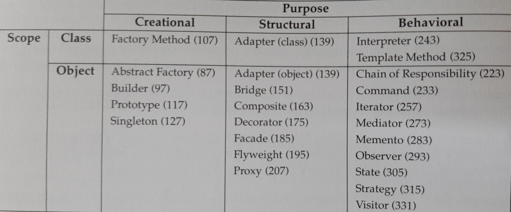

- Four essential elements of a pattern:
    1. Pattern name
        - captures the essence.
        - serves as the vocabulary through which we communicate.
    2. Problem
        - the context, conditions under which a pattern is applied.
    3. Solution
        - the relationships, responsibilities, and collaborations of the
        elements that make up the design.
    4. Consequences
        - evaluation of trade-offs on the design's impact on a system's
        flexibility, extensibility, or portability.

# How Design Patterns Solve Design Problems

## Finding an Appropriate Object
- First of all, what exactly is an object?
    - Just a *package of **data** and **operations** on those data*.
    - **Encapsulation** means that objects perform operations **only** when
    there is a **request** from a client. In other words, internal states of an
    object cannot be accessed directly and is invisible.
- 3 approaches
    1. noun, verb -> object, operation
    2. collaborations and responsibilities in the system
    3. modeling the real world
- Design patterns help identify less-obvious **abstractions** and provide
objects to capture them, empowering programmers to come up with more flexible
designs. 
    - e.g. composite pattern provides an abstraction for objects that
    don't have a physical counterpart.
    - e.g. strategy pattern describes how to implement interchangeable
    families of algorithms.

## Determining Object Granularity
- Design patterns provide a toolkit to help determine object
granularity.
    - e.g. facade pattern to represent complete subsystems as objects.
    - e.g. abstract factory and visitor, design patterns that describe
    specific ways of decomposing an object into smaller objects.

## Specifying Object Interfaces
- Interface
    - is the set of all signatures defined by an object's operation.
    - characterizes **the complete set of requests that can be sent to the
    object**.
    - A **type** is just a name used to denote a particular interface.
    - Therefore, a subtype inherits **the interface** of a supertype.
- Dynamic Binding and Polymorphism
    - Interface has nothing to with implementation, e.g. `LinkedList` and 
    `ArrayList` have different implementations of operations defined in the
    interface `List` in Java.
    - Therefore, when a request is sent to an object, the particular operation
    that's performed depends on *both* the request and the receiving object.
    - This *run-time* association of a request to an object and its operation
    is called **dynamic binding**.
    - Dynamic binding allows substitution of objects that have identical
    interfaces for each other at run-time, and this substitutability is called
    **polymorphism**.
- Design patterns help you specify **interfaces** by identifying their key
elements and the kinds of data that get sent across an interface.
    - e.g. memento pattern describes how to encapsulate and save the internal
    state of an object so that the object can be restored to that state later.
    The pattern stipulates that two interfaces must be defined: a restricted
    one for clients and a privileged one for the original object to store and
    retrieve state in the memento.

## Specifying Object Implementation
- **Class** is what defines an object's **implementation**.
    - In contrast, an object's **type** only refers to its **interface**, the
    set of requests to which it can respond.
- Most programming languages don't support the distinction between interface
and implementation, but many of the design patterns depend on this distinction.
- > Program to an interface, not an implementation.

    - fully support polymorphism as all subclasses share the same interface.
    - ensures abstraction and encapsulation.
    - reduces implementation dependencies.
    - results in **reusable object-oriented design**.
    - Creational patterns ensure that your system is written in terms of
    interfaces, not implementations.
