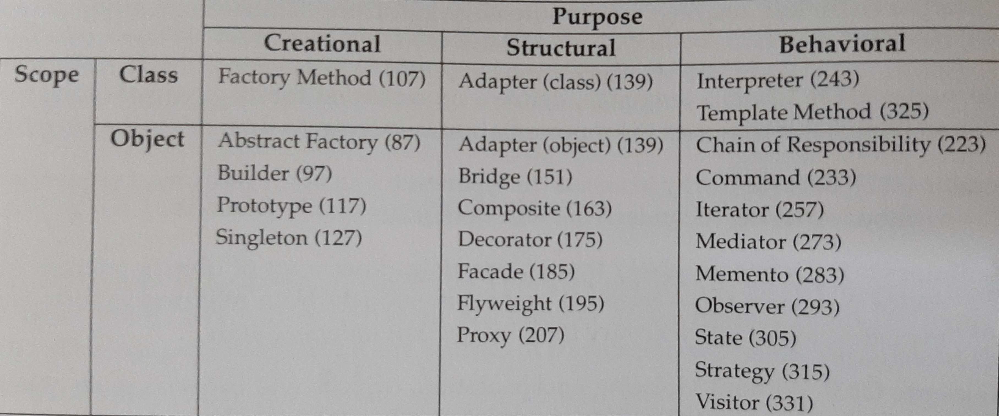

# Vim
- jump-motion
    - jump list
        - a window-wise record of jumps made
        - `:ju[mps]`, `:cle[arjumps]`
            - print / clear the jump list of the current window
        - `CTRL-O`, `CTRL-I`
            - go to `[count]` old / new cursor positions
            - e.g. `3<C-o>` goes 3 cursor positions back in jump list.
    - various motions
        - `%`
            - jump (forward and backward) to a matching character for `()`,
            `[]`, `{}`
            - alternatives for other matching characters:
                - find commands, i.e. `f`, `F`, e.g. `f"`
                    - till commands, i.e. `t`, `T` can be useful too
                - different purpose, but visual mode text selection, e.g. `vi"`
        - `H`, `M`, `L`
            - jump to the top, middle, bottom of the **screen** (not file)
            - `zt`, `zz`, `zb`
                - not jump motions but scrolls so that the current line becomes
                the top, middle, bottom of the screen.

# Clean Code

## Chapter 2: Meaningful Names
- Use **intention-revealing** names
- Avoid **disinformation** 
- Make meaningful **distinctions**
- Use pronounceable names
- Use **searchable** names
    - > The length of a name should correspond to the size of its scope.

# Design Patterns

## Chapter 1: Introduction
- classification of design patterns
    - 
